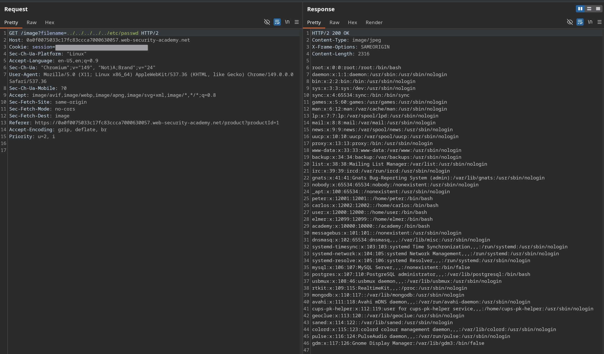
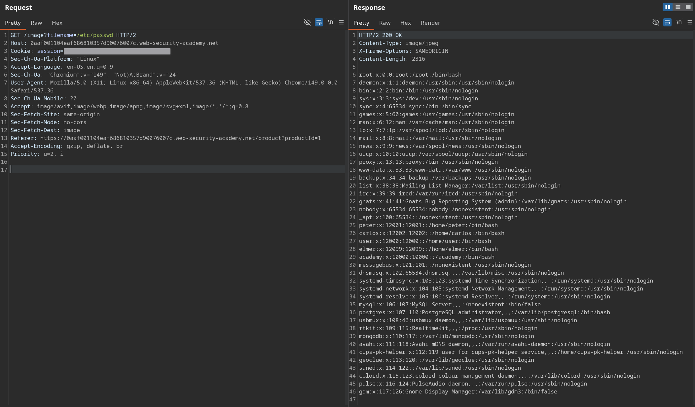
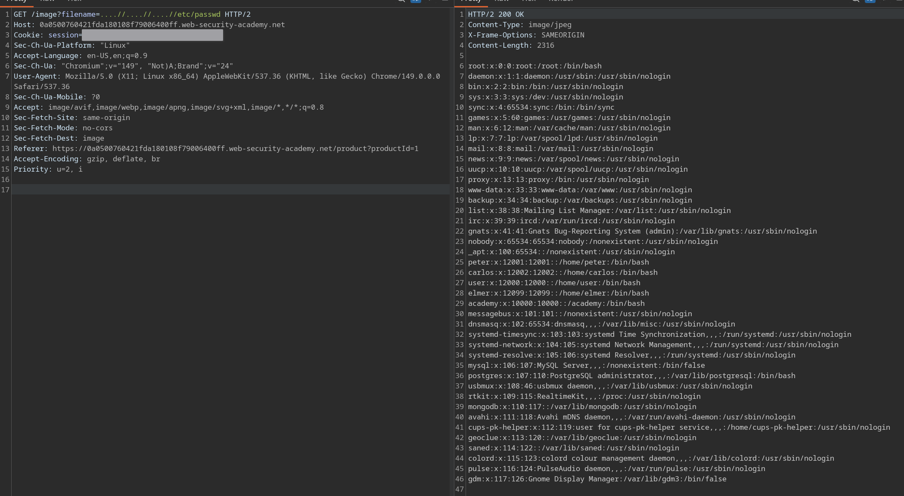
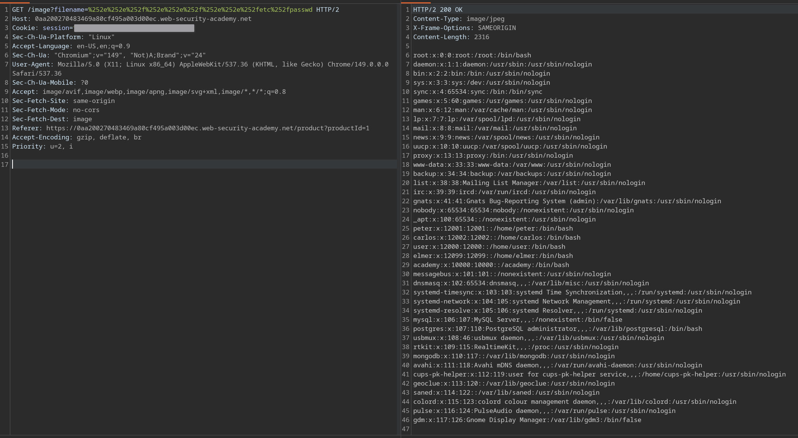
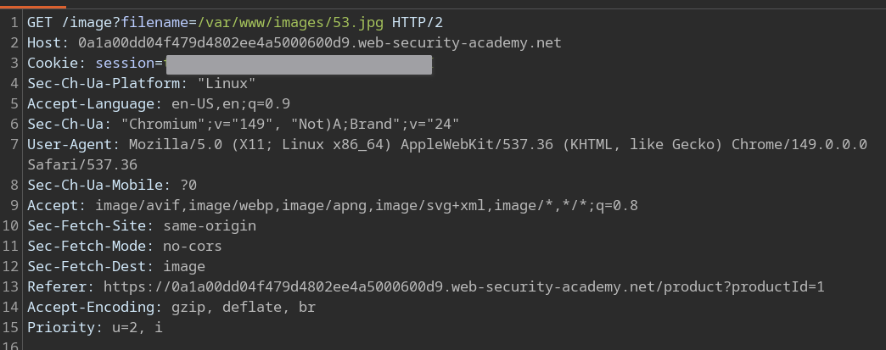
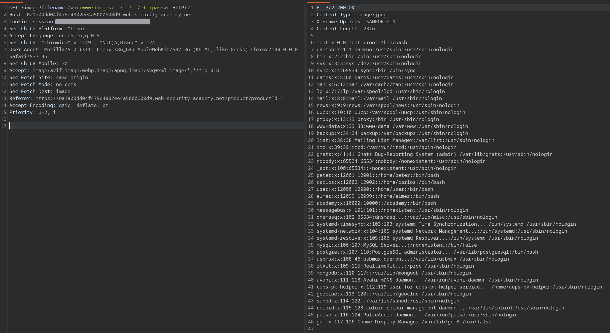
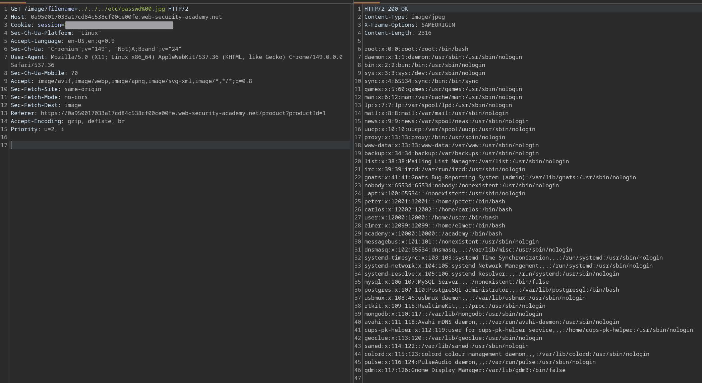

# Path traversal
- Path traversal hay directory traversal là lỗ hổng cho phép attacker đọc các file tùy ý trên server hoặc tệ hơn là có quyền thực thi. 
- Bản chất của lỗ hổng này là ta sẽ sử dụng `.`, `..` và `/` để có thể escape khỏi folder cho phép và xâm nhập vào các folder cấp cao hơn. 

## POC
- Trang web có tag load ảnh như trên:
```

```
Và path của nó là:
```
/var/www/images/218.png
```
- Vậy nên nếu ta muốn escape khỏi folder đó để đọc được `/etc/passwd` thì ta sẽ thực hiện:
```

```
Lúc này path của nó là:
```
/var/www/images/../../../etc/passwd
```
Vì thế lúc này file ta đang đọc chính là `/etc/passwd`.
- Trên hệ điều hành Windows thì `/` hay `\` đều hợp lệ.

# File path traversal, simple case - APPRENTICE

## Description
This lab contains a path traversal vulnerability in the display of product images. 
To solve the lab, retrieve the contents of the `/etc/passwd` file.

## Solve
- Bài này ta sẽ thực hành ví dụ vừa đề cập ở trên.

Note: Khi đã chạm tới `/` thì dù `../` bao nhiêu lần vẫn sẽ không lên cấp cao hơn hay bị lỗi. Vì thế với những bài blackbox, ta có thể spam `../` nếu không biết chắc chắn bản thân đang nằm ở cấp folder nào.

# File path traversal, traversal sequences blocked with absolute path bypass - PRACTITIONER

## Description
This lab contains a path traversal vulnerability in the display of product images.
The application blocks traversal sequences but treats the supplied filename as being relative to a default working directory.
To solve the lab, retrieve the contents of the `/etc/passwd` file.

## Solve
- Bài này đã chặn `../` và dùng relative path.
- Ví dụ với python hay js nó có các thư viện `os.path.join` và `path.join` dùng để nối path lại:
```
base = "/var/www/images"
path = os.path.join(base, user_input)
```
Tuy nhiên bản thân các thư viện này lại ưu tiên absolute path, vì thế lỗ hổng ở đây là với `user_input` ta nhập:
```
/etc/passwd
``` 
Thì nó sẽ bỏ qua base mà chạy chính xác absolute path.


# File path traversal, traversal sequences stripped non-recursively - PRACTITIONER

## Description
This lab contains a path traversal vulnerability in the display of product images.
The application strips path traversal sequences from the user-supplied filename before using it.
To solve the lab, retrieve the contents of the `/etc/passwd` file.

## Solve
- Bài này cũng đã thực hiện chặn `../` bằng cách xóa nó nhưng không đệ quy. Vì thế nếu sau khi payload bị xóa vẫn tạo ra được `../` thì ta sẽ bypass được. Cụ thể:
```
....//....//....//etc/passwd
```
Sẽ thành 
```
../../../etc/passwd
```
Note: Tư duy ngược để chống lại kiểu này thì ta chỉ cần thực hiện đệ quy, tuy nhiên cách này sẽ không thành công với một số trường hợp khác như encode url hay attacker có thể lợi dụng đệ quy đó để thực hiện DoS.


# File path traversal, traversal sequences stripped with superfluous URL-decode - PRACTITIONER

## Description
This lab contains a path traversal vulnerability in the display of product images.
The application blocks input containing path traversal sequences. It then performs a URL-decode of the input before using it.
To solve the lab, retrieve the contents of the `/etc/passwd` file.

## Solve
- Để giải bài này thì ta phải thực hiện encode path của mình. Dấu `.` sẽ được encode thành `%2e` còn dấu `/` sẽ thành `%2f`. Vì thế `../../etc/passwd` sẽ thành `%2e%2e%2f%2e%2e%2fetc%2fpasswd`. Tuy nhiên payload này không thực hiện được vì bản thân web server đã thực hiện decode trước 1 lần rồi (có thể tự test ở các lab trước).
- Nên giải pháp là ta sẽ encode lần thứ 2 (1 lần ở web server và 1 lần ở source code của developer) với `%` sẽ thành `%25` nên payload chính xác của ta là:
```
%252e%252e%252f%252e%252e%252f%252e%252e%252fetc%252fpasswd
```
Tương đương với 
```
../../../etc/passwd
```


# File path traversal, validation of start of path - PRACTITIONER

## Description
This lab contains a path traversal vulnerability in the display of product images.
The application transmits the full file path via a request parameter, and validates that the supplied path starts with the expected folder.
To solve the lab, retrieve the contents of the `/etc/passwd` file.

## Solve

- Bài này đã lộ hẳn absolute path và nó yêu cầu tiền tố phải là `/var/www/images/` (nếu nhập thẳng `/etc/passwd` sẽ báo lỗi) nên payload của ta khá đơn giản:
```
/var/www/images/../../../etc/passwd
```


# File path traversal, validation of file extension with null byte bypass - PRACTITIONER 

## Description
This lab contains a path traversal vulnerability in the display of product images.
The application validates that the supplied filename ends with the expected file extension.
To solve the lab, retrieve the contents of the `/etc/passwd` file.

## Solve
- Bài này yêu cầu filename phải có file extension là loại tệp được valid hay chính xác là đuôi `png`. Tuy nhiên `/etc/passwd` lại là file plaintext file. Vì thế ta sẽ tận dụng một lỗ hổng từ `null byte`.
- `Null byte` hay `%00` dùng làm kí tự cuối để ngắt chuỗi kí tự trong các hệ thống lập trình cũ. Vì thế cách giải bài này là ta sẽ dùng payload:
```
../../../etc/passwd%00.jpg
```
Để vừa thỏa mãn file extension đồng thời hệ điều hành khi đọc tới `%00` thì sẽ dừng lại và cắt hoàn toàn phần sau.


# Preventing
- Cách tốt nhất là tránh hoàn toàn việc truyền untrusted data vào filesystem APIs.
- Nếu bắt buộc phải truyền thì ta phải lọc thêm 2 lớp:
    - Sử dụng whitelist, nếu không thể thì phải xác minh dữ liệu bằng các kí tự hợp lệ như chữ hay số.
    - Sau khi xác thực dữ liệu thì thực hiện nối vào base directory và chuẩn hóa nó. Sau đó kiểm tra đường dẫn đã chuẩn hóa.